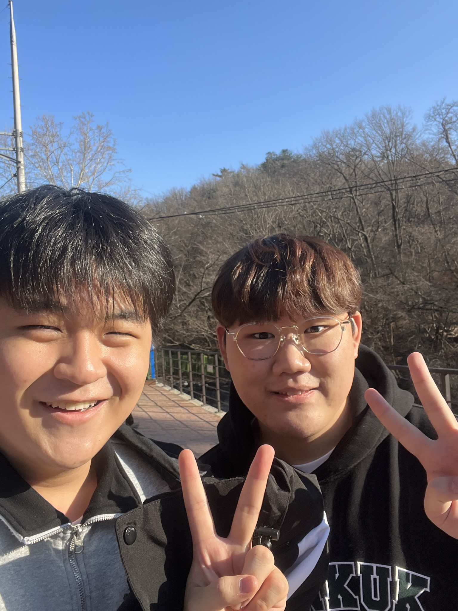
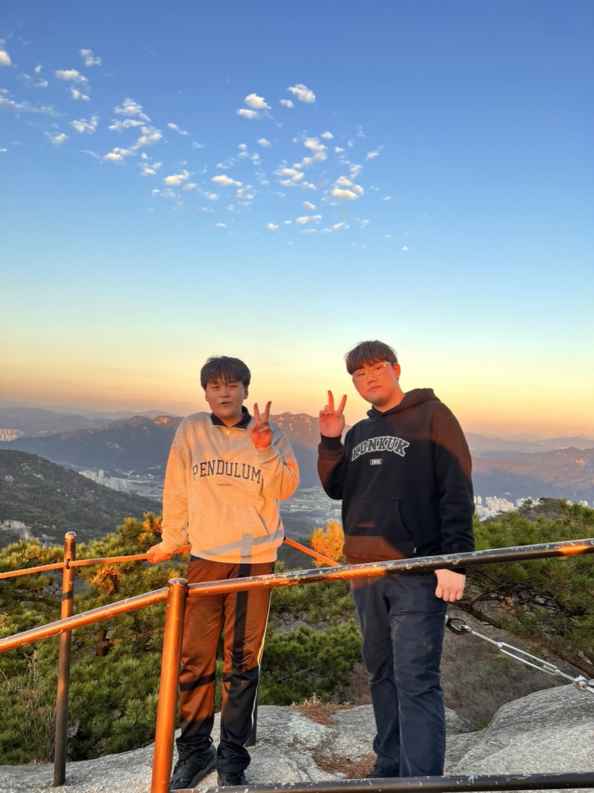
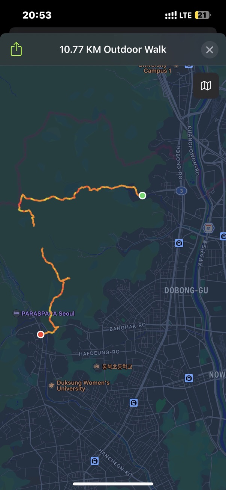
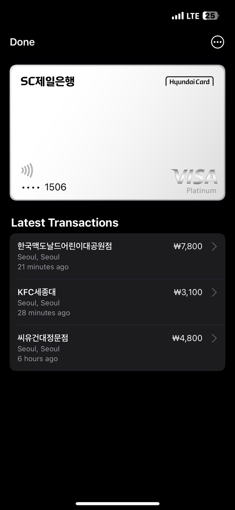

# 이번 달 목표(였던 것)

사실 이번 달은 어차피 3월이니깐 공부는 크게 안 할 것 같고 후배들이랑 조금 친해지고 과제나 열심히 해보자! 라는 목표를 가졌었는데, 그냥 술만 진탕 마시고 이룬 건 없는 것 같기도 하고.. 곧 시험 기간이니깐 공부는 4월부터..

# 올 것이 와버린 3월

## 첫 날부터 비빔밥 회의

3월이 시작되자마자, 비빔밥 정기(이자 마지막이 될 것 같은) 회의를 했다.
어쩌다 **미래인재양성부 장관**이라는 과분한 칭호를 얻게된 것 같아 어깨가 무거워진 만큼 열심히 활동해야하지 않나 하는 생각이 들었다.
올 해 비빔밥은 작년과는 조금 다른 방향으로 **비빔뷰**라는 이름으로 격월마다 정기 컨퍼런스를 진행하기로 했다.
나도 세션을 하나 맡게 되었고, 이외에도 자잘자잘한 할 일이 많아져서 조금 바쁠 것 같다. (이때까지만 해도 할 줄 알았지..)

## 왜 벌써 개강이지?

그리고 다음 날 3월 2일, 개강해버린것이다. 오랜만에 수업 들으니까 강의실에 앉아있는게 그렇게 힘들 수가 없다. 수업만 들으면 되나? 과제도 미친듯이 쏟아져서 하루에 레포트도 20장 넘게 쓰고 하니까 사람이 그렇게 바쁠 수가 없다. 분명 1학년때는 이렇게 바쁘진 않았던 것 같은데, 2학년 되니까 생각보다 신경쓸 게 많아진 느낌이다.

개강해버리니깐 개인 프로젝트에 손 쓸 겨를도 없고 과제 해나가기도 바빠졌다. 지금 블로그 유지보수 안 한지도 조금 됐고.. 아직 넣고 싶은 기능이 좀 (많이) 남았는데 다음 달부터는 짬짬히 개발해서 업데이트좀 해야할 것 같다.

## 멘토멘티와 이것저것

후배들이랑 친해지자는 마음으로 멘토멘티에도 멘토로 참여했는데, 몇몇 후배와 친해져서 좋았다. 근데 밥약으로 규카츠를 사달라 할 줄은 몰랐지..

# 아 ㅋㅋ 드디어 미쳐버린 거임

14일에는 윤수현이 영우 과제로 도봉산 등산해야한다고 끌고가는 바람에 4시간 반동안 산 타고 왔다.
분명 나는 등산 처음 해보는데 왜 이렇게 빡센 코스를 고른거지?
지금 생각해보면 미친건가 싶다.
아무튼 자구 수업도 째고 7호선 타고 난생 처음 도봉산역으로 가봤는데, 뭔가 서울은 아닌 느낌..
서울에 이런 곳도 있구나 하면서 출발했다.

<figure>

<figcaption align="center">
  <b>자신의 미래를 알지 못한 채 도봉산 입구에서 웃고 있는 이율원과 윤수현</b>
</figcaption>
</figure>
분명히 처음 산 입구 들어갔을 땐 보도블럭도 깔려있고 길도 좋고 다 좋았는데, 갑자기
영우가 _이건 내가 생각하던 등산이 아냐!_ 하면서 흙길을 굳이굳이 찾아서 들어가서..
굉장히 험한 길로 들어가버린 것이었고.. 분명 올라가는건 그래도 할 만 했었는데 내려가는
길이 왜 더 험한지 모르겠고.. 아무튼 정상까지 찍고 히히덕거리면서 _아 빨리 내려가서
밥먹고 씻고 자고싶다..._ 하면서 즐겁게 사진 찍고 행복했었는데
<figure>

<figcaption align="center">
  <b>자신의 미래를 알지 못한 채 도봉산 정상에서 웃고 있는 이율원과 윤수현</b>
</figcaption>
</figure>
이 때 사진 찍을 때 슬슬 해가 지고 있다는걸 심각하게 여겼어야 했다. 정상 찍고 내려가자
마자 해는 완전히 저버렸고, 처음에는 서울에 불 하나 안 들어오는 데도 있구나.. 하면서
그래도 내려갈 만은 한데..? 싶었지만, 해가 완전히 다 져버리는 바람에 길이 하나도 안
보여서 나가는 길만 두 시간동안 찾아 헤멨다.
<figure>

<figcaption align="center">
  <b>그 날의 흔적</b>
</figcaption>
</figure>
결국 어떻게 어떻게 내려왔는데.. 나는 분명히 도봉동에서 출발했는데 왜 우이동으로 나온거지?
아무튼 산에서 벗어나고 지나다니는 버스를 보면서 울 뻔했다. 바로 우이신설타고 신설동으로
도망쳐서 부대찌개 먹으면서 다시는 산 안타야지 다짐하고 행복하게 집에 돌아갔다.

그 다음날은 심마니에서 멘토멘티 조끼리 술 한 잔 하고,
그 다음날은 비빔밥 개강 총회 가서 또 미친듯이 술 마시고,
그 다음날은 또 퇴근하는 길에 성원범이 불러서 술 한 잔 하고 난 다음 날..
등산 후에 내리 3일 동안 술을 쑤셔넣은 탓에 결국 술병에 걸려버렸다. 목감기가 세게 와버려서 한 3일 간은 목소리도 하나도 안 나오고.. 침대에서 골골댔다. 그 와중에 또 수업은 들어야 해서 진짜 너무 힘들었다.

# 드디어 애플페이?

21일 드디어 한국에 애플페이가 출시됐다. 출시되자마자 현대카드 신청 넣었는데 아쉽게도 만 19세는 신용카드 발급하려면 4대보험 3개월 가입 이력이 있어야 한대서 포기하고, 팔자에도 없는 SC은행 계좌 만들어서 체크카드 하나 만들어서 바로 등록해봤다. 생각보다 결제 속도도 너무 빨랐고, 애플워치로도 결제가 되니까 편해서 지금도 자주 쓰고 있다.

<figure>

<figcaption align="center">
  <b>돈 쓰기 쉽다</b>
</figcaption>
</figure>
요즘은 애플페이 되는 곳 찾아가서 돈 쓰는 재미로 살고 있다. 편의점에서 카드 안 꺼내도
되는게 너무 편하다.

# MT

25, 26일 출근 안 하고 MT에 갔다. 오랜만에 술 게임 하고 그러니까 재미는 있는데 정신이 하나도 없었다. 그냥 동기들이랑 얘기나 하면서 술 마시는게 재밌는데...

# 비빔뷰

이번 달에 가장 인상 깊었던 행사다. 포스터 디자인도 하고, 팜플렛 당일 인쇄한다고 아침부터 인쇄소 뛰어다니고, 세션 준비한다고 밤 새고.. 준비 엄청 열심히 했는데.. 나는 발표 할 줄 알았지..

신입생 대상으로 **당신이 C언어를 공부해야 하는 이유**라는 주제로 세션을 준비했는데, 제목은 조금 어그로고, 내용은 C언어가 (학교 수업에 있어서) 중요한 이유와, C언어 이런 식으로 공부하세요, 문법만 익히지 마세요 같은 내용이었다. 아마 신입생한테는 도움이 되는 내용이었겠지만.. 대관 시간이 끝나버려 5월 비빔뷰로 미뤄졌다.

5월이면 이미 중간고사도 끝나고 난 이후라, 내용을 조금 수정해서 5월에 다시 발표할 수 있도록 조금 보완을 해야겠다.

# 물을 술 같이, 술을 물 같이

이번 달은 술을 너무 많이 마신 것 같다. 분명 2학년 되면 술 많이 안 마시겠지 싶었는데 무슨 1학년 때보다 더 마시고 다닌 느낌. 술 마시느랴 과제 하느랴 출근하느랴 힘들어 죽을 것 같다.
그래도 학기 초라 많이 마신거지 슬슬 덜 마시지 않을까..?

# 그래서 4월엔?

4월에는 중간고사 공부 + 백엔드 공부를 조금 해볼까 싶다. 이번 학기에 전공이 많아서 학점을 조금 챙길 필요가 있을 것 같고.. 전기프 구현도 슬슬 시작해야할 것 같아서 할 게 많을 것 같다.
백엔드 공부는 개인적으로 진행하든, 비빔밥 OB 세션을 듣든 해서 채워가고 싶은 부분이다. 아직 백엔드를 다뤄본 적이 한 번도 없다시피 하는 것도 있고..
UI 구성 같은 부분에 개인적인 흥미가 많아서 프론트엔드가 적성에 맞다고 생각하고 있긴 한데, 그렇다고 덮어두고 프론트엔드만 하기에는 좀 후회할 것 같고,
프론트엔드만 파기 전에, 백엔드 찍먹을 한 번쯤은 해봐야 할 것 같아서 그런 탓도 있다.

> _아 슬슬 종강할 때 된 것 같은데.._
