본 포스트의 내용은 2022년 2학기 이산수학 과목을 수강하며 공부한 내용 중 기말고사 시험 범위에 해당하는 내용을 정리한 문서로, $\LaTeX$로 작성된 파일을 `pandoc`을 이용하여 Markdown으로 변환한 문서입니다.

제가 모르는 부분 또는 생소한 부분 위주로 정리한 노트이므로, 생략된 부분이 있어 본 포스트만 참고할 경우 이해에 어려움이 있을 수 있으니, 참고 바랍니다.

원본 파일의 내용을 확인하고 싶으시다면, [여기](https://github.com/sterdsterd/KU-CSE/blob/main/BBAA11972%20DISCRETE%20MATHEMATICS/lecturenote-final.tex)를 클릭하여 원본 `.tex`파일이나, [여기](https://github.com/sterdsterd/KU-CSE/blob/main/BBAA11972%20DISCRETE%20MATHEMATICS/lecturenote-final.pdf)를 눌러 `.pdf` 파일을 확인하실 수 있습니다.

# Week 9

## 관계

- 서로 다른 두 집합에 속하는 원소들 간의 순서<sup>Order</sup>를 표현

- 순서쌍 집합(곱집합의 부분 집합)에 속하면서 순서쌍을 이루는 원소들은 '관계'가 있다

## 이항 관계<sup>Binary Relation</sup>

집합 $A$에서 집합 $B$로 가는 관계\
$R$: $A \times B$의 부분 집합\
$a \in A, b \in B$일 때, $(a, b) \in R \to {_aR_b}$;
$(a, b) \not\in R \to {_aR\mkern-12mu/\mkern5mu_b}$

정의역<sup>Domain</sup>: $\mathrm{dom}(R) = \{a | a \in A\}$\
공변역<sup>Codomain</sup>: $\mathrm{codom}(R) = \{b | b \in B\}$\
치역<sup>Range</sup>: $\mathrm{ran}(R) = \{b | (a, b) \in R\} \subseteq B$\
\
$n$항 관계<sup>$n$-ray Relation</sup>:
$R \subseteq A_1 \times A_2 \times \cdots \times A_n$의 부분 집합\
\
역관계<sup>Inverse Relations</sup>: $B$에서 $A$로의 관계,
$R^{-1} = \{(b, a) | (a, b) \in R\}$, $_aR_b$ 존재 $\to {_bR^{-1}_a}$
존재

## 관계의 표현

### 서술식 방법

e.g.) $A={1, 2, 3}$에서 원소 $a, b$가 $a \geq b$인 관계 $R$

### 나열식 방법

- 화살표 도표<sup>Arrow diagram</sup>

- 좌표 도표<sup>Coordinate diagram</sup>

  - 집합 $A$의 원소를 $x$축 위의 점으로, $B$의 원소를 $y$축 위의
    점으로 표시

- 방향 그래프<sup>Directed graph</sup>

  - 관계 $R$이 하나의 집합 $A$에 대한 관계 표현일 때

  - $A$의 각 원소 $\Rightarrow$ 그래프의 정점<sup>Vertex</sup>

  - $(a, b) \in R$이면 $a$에서 $b$로 화살표가 있는 연결선<sup>Edge</sup>로
    표현

- 관계 행렬<sup>Relation matrix</sup>

  - 부울<sup>Boolean</sup> 행렬 이용

  - $A = \{a_1, a_2, \cdots, a_m\}$에서
    $B = \{b_1, b_2, \cdots, b_n\}$로 가는 관계 $R$에 대한
    $m \times n$ 행렬 $M_R=[m_{ij}]$
    $$
    m_{ij} = \begin{cases}
                                    1, (a_i, b_j) \in R \\
                                    0, (a_i, b_j) \not\in R
                                \end{cases}
    $$
  - e.g.) $A=\{1, 2, 3\}$과 $B=\{a, b\}$의 이항 관계
    $R = \{(1, b), (2, a), (2, b), (3, a)\}$
    $$
    M_R=\begin{bmatrix}
          & a & b \\
        1 & 0 & 1 \\
        2 & 1 & 1 \\
        3 & 1 & 0
    \end{bmatrix}\quad\quad\quad
    M_{R^{-1}}=\begin{bmatrix}
          & 1 & 2 & 3 \\
        a & 0 & 1 & 1 \\
        b & 1 & 1 & 0
    \end{bmatrix}
    $$

## 관계의 성질

- 반사 관계<sup>Reflexive Relation</sup>
  - 모든 $a \in A$에 대해 $(a, a) \in R$인
    관계, $\begin{bmatrix}
        1 &   &        &   \\
          & 1 &        &   \\
          &   & \ddots &   \\
          &   &        & 1
    \end{bmatrix}$
- 비반사 관계<sup>Irreflexive Relation</sup>
  - 모든 $a \in A$에 대해
    $(a, a) \not\in R$인 관계, $\begin{bmatrix}
        0 &   &        &   \\
          & 0 &        &   \\
          &   & \ddots &   \\
          &   &        & 0
    \end{bmatrix}$
- 반사 관계도 비반사 관계도 아닌 경우
  - $\begin{bmatrix}
        0 &   &        &   \\
          & 1 &        &   \\
          &   & \ddots &   \\
          &   &        & 1
    \end{bmatrix}$
- 대칭 관계<sup>Symmetric Relation</sup>

  - $\exists a, b \in A$에 대해 $(a, b) \in R$이면 $(b, a) \in R$, $(a, b)$
    존재 $\to (b, a)$ 존재

  - 관계 행렬에서 대각 성분 기준으로 대칭이면 대칭 관계 성립

- 반대칭 관계

  - $\exists a, b \in A$에 대해 $a = b$이고, $(a, b) \in R$이면
    $(b, a) \in R$

  - $a \neq b$이고, $(a, b) \in R$이면 $(b, a) \not\in R$

- 추이 관계
  - $\exists a, b, c \in A$에 대해 $(a, b) \in R$이고,
    $(b, c) \in R$이면 $(a, c) \in R$인 관계

## 합성 관계<sup>Composite Relation</sup>

$A$에서 $B$로의 관계 $R_1$과, $B$에서 $C$로의 관계 $R_2$에 대해서,
$A$에서 $C$로의 합성 관계 $= R_1 \cdot R_2$ 또는 $R_1 R_2$

$$
R_1 \cdot R_2 = \{(a, c) | a \in A, c \in C, (a, b) \in R_1\text{이고 }(b, c) \in R_2\}
$$

- 합성 관계의 연산: $R \cdot S = M_{R \cdot S} = M_R \odot M_S$

e.g.) $M_R = \begin{bmatrix}
          & 1 & 2 & 3 \\
        a & 0 & 1 & 0 \\
        b & 0 & 1 & 1 \\
        c & 1 & 0 & 0 \\
        d & 1 & 1 & 1
    \end{bmatrix} \quad\quad M_S = \begin{bmatrix}
          & x & y & z \\
        1 & 1 & 0 & 1 \\
        2 & 0 & 1 & 1 \\
        3 & 1 & 1 & 0 \\
    \end{bmatrix}$

$$
\begin{aligned}
    R \cdot S & = M_R \odot M_S\\
     &= \begin{bmatrix}
        0 & 1 & 0 \\
        0 & 1 & 1 \\
        1 & 0 & 0 \\
        1 & 1 & 1
    \end{bmatrix}\odot\begin{bmatrix}
        1 & 0 & 1 \\
        0 & 1 & 1 \\
        1 & 1 & 0
    \end{bmatrix}\\
    & =\begin{bmatrix}
        (0 \land 1)\lor(1 \land 0)\lor(0 \land 1) \quad (0 \land 0)\lor(1 \land 1)\lor(0 \land 1) \quad (0 \land 1)\lor(1 \land 1)\lor(0 \land 0) \\
        (0 \land 1)\lor(1 \land 0)\lor(1 \land 1) \quad (0 \land 0)\lor(1 \land 1)\lor(1 \land 1) \quad (0 \land 1)\lor(1 \land 1)\lor(1 \land 0) \\
        (1 \land 1)\lor(0 \land 0)\lor(0 \land 1) \quad (1 \land 0)\lor(0 \land 1)\lor(0 \land 1) \quad (1 \land 1)\lor(0 \land 1)\lor(0 \land 0) \\
        (1 \land 1)\lor(1 \land 0)\lor(1 \land 1) \quad (1 \land 0)\lor(1 \land 1)\lor(1 \land 1) \quad (1 \land 1)\lor(1 \land 1)\lor(1 \land 0)
    \end{bmatrix}\\
    & =\begin{bmatrix}
        0 & 1 & 1 \\
        1 & 1 & 1 \\
        1 & 0 & 1 \\
        1 & 1 & 1
    \end{bmatrix}
\end{aligned}
$$

- 합성 관계의 거듭제곱 $R^n = \begin{cases}
        \begin{array}{ll}
            R              & (n=1)   \\
            R^{n-1}\cdot R & (n > 1)
        \end{array}
    \end{cases}$

- 기타 연산

  - $R_1 \cap R_2 = M_{R_1 \cap R_2} = M_{R_1} \land M_{R_2}$\
    $\phantom{R_1 \cap R_2} = \{(a, b) \in R_1 \cap R_2 | (a, b) \in R_1 \land (a, b) \in R_2\}$

  - $R_1 \cup R_2 = M_{R_1 \cup R_2} = M_{R_1} \lor M_{R_2}$\
    $\phantom{R_1 \cup R_2} = \{(a, b) \in R_1 \cup R_2 | (a, b) \in R_1 \lor (a, b) \in R_2\}$

  - $R_1 - R_2 = M_{R_1-R_2} = \{(a, b) \in R_1 - R_2 | (a, b) \in R_1 \land (a, b) \not\in R_2\}$

## 추이 관계와 합성 관계

> \[정리\] 추이 관계와 거듭제곱의 관계:\
> 집합 $A$에 대한 관계 $R$이 추이 관계일 필요충분조건은 모든 양의 정수
> $n$에 대하여 $R^n \subseteq R$이다.

## 폐포<sup>Closure</sup>

폐포<sup>Closure</sup>: $A$상의 관계 $R$이 어떤 성질을 만족하지 않을 때, 그
성질을 만족하도록 순서쌍들을 추가하여 $R^*$(원하는 성질이 만족되는 가장
작은 집합)로 확장\
\
성질 $P$에 대한 관계 $R$의 폐포: $A$에 대한 관계 $R$에 대해, $R^*$가
$R$을 포함하면서 성질 $P$를 가질 때, $R^*$는 $P$에 대한 $R$의 폐포

### 반사 폐포<sup>Reflexive Closure</sup>

$A$에 대해, $R$을 포함하면서 반사 관계를 갖는 관계 $S$\
$S = R \cup \{(a, a)|a \in A\}$

### 대칭 폐포<sup>Symmetric Closure</sup>

$A$에 대해, $R$을 포함하면서 대칭 관계를 갖는 관계 $S$\
$S = R \cup \{(b, a) \in A \times A|(a, b) \in R\} = R \cup R^{-1}$

### 추이 폐포<sup>Transitive Closure</sup>

$A$에 대해, $R$을 포함하면서 추이 관계를 갖는 관계 $S$\
$S = R \cup \{(a, c) \in A \times A|(a, b) \in R\ \land (b, c) \in R\}$

## 연결 관계<sup>Connectivity Relation</sup> $R^*$

$R^* = \bigcup^\infty_{n = 1} R^n = R^1 \cup R^2 \cup \cdots \cup R^n$\
연결 관계 $R^*$는 $R$의 추이 폐포

> \[정리\] $R$이 $n$개의 원소를 갖는 집합에 대한 관계이고, $M_R$을 관계 $R$에 대한
> 부울 행렬이라고 했을 때, $R$의 추이 폐포 $R^*$는
>
> $$
> M_{R^*}=M_R\lor M_{R^2}\lor M_{R^3}\lor \cdots \lor M_{R^n}
> $$

## 예제 풀이

양의 정수<sup>Positive Integer</sup> 집합에서 두 원소 $a, b$에 대해서 '$a$가
$b$를 나눈다'라는 관계는 어떤 성질을 만족하는가? (관계(1) 강의 참조)

# Week 10

## 동치 관계<sup>Equivalence Relation</sup>

반사 관계, 대칭 관계, 추이 관계가 모두 성립하는 경우

## 동치류<sup>Equivalence Class</sup> $[a]$

$A$에 대한 관계 $R$이 동치 관계일 때, $R$에 대한 $a$의 동치류: $a$와
순서쌍을 이루는 원소들의 집합\
$[a] = \{x|(a, x) \in R\}$

## 동치 관계와 분할<sup>Partitions</sup>

- 분할: 공집합이 아닌 집합 $A$의 분할 조건 ($A_i$는 $A$의 부분 집합)

  - $A_i \neq \varnothing, 1 \leq i \leq n$

  - $A = \bigcup_{i = 1}^n A_i$

  - $A_i \cap A_j = \varnothing, i \neq j$

- 동치류와 분할: $A$에 대한 관계 $R$이 동치 관계일 때, 동치류 집합
  $S=\{A_1, A_2, \cdots, A_k\}$는 다음 만족함

      - $i = 1, 2, \cdots, k$일 때, $A_i \neq \varnothing$

      - $S = A_1 \cup A_2 \cup \cdots \cup A_k$

      - $i \neq j$면, $A_i \cap A_j = \varnothing$

## 부분 순서 관계

- 순서 관계: 집합 원소들 간 순서를 나타내기 위한 순서 관계

> e.g.)
>
> - 프로젝트에서 수행해야 할 작업들의 집합에서 작업 $x, y$에 대해 $x$가
>   $y$보다 먼저 수행되어야 한다면 $(x, y)$의 순서쌍으로 구성되는 순서
>   관계
>
> - 수학의 대소 관계인 $<$의 순서 관계, $x$가 $y$보다 작다 $(x, y)$

- 부분 순서 관계<sup>Partially Ordered Relation</sup>: 집합 $A$에 대한 관계 $R$이
  반사, 반대칭, 추이 관계일 때 관계 $R$
- 부분 순서 집합<sup>Partially Order Set, Poset</sup>: $R$이 $A$에 대한 부분
  순서 관계이면 순서쌍 $(A, R)$
- 부분<sup>Partial</sup>이라는 용어를 쓰는 이유: 집합 $A$의 원소의 모든 쌍이 관계를
  가지는 것은 아니기 때문
- 부분 순서 집합 기호: $(A, \lesssim)$은 $A$의 부분 순서 관계
- 집합 $A$에 대한 관계 $R$이 부분 순서 관계

  - $A$의 두 원소 $x, y$에 대하여 $(x, y) \in R$을 $x \lesssim y$로 표기

  - '$x$가 $y$를 선행한다' ($x$ precedes $y$)라고 읽음

- 비교 가능<sup>Comparable</sup>: 부분 순서 집합 $(A, \lesssim)$에서 $x, y \in A$가
  $x \lesssim y$ 또는 $y \lesssim x$이면 $x$와 $y$는 비교 가능

> e.g.) 자연수들의 집합 $\mathbb{N}$상의 관계 '배수이다'라고 할 때, 자연수
> 3과 9는 비교 가능한가? 또, 7과 4는 비교 가능한가?

    - $3 \lesssim 9$이므로 3과 9는 비교 가능하다.

    - $4 \not\lesssim 7$이므로 4와 7은 비교 가능하지 않다.

- 선형 순서<sup>Linear Order</sup>

  - $R$이 부분 순서를 만족

  - 만약 $a \in A, b \in A$라면 $_aR_b,{_bR_a}$ 또는 $a = b$중 하나가
    성립

- 선형 순서 집합<sup>Linearly Ordered Set</sup>: 집합 $A$의 모든 두 원소가 비교
  가능하면 $A$는 선형 순서 집합

## 하세 도표<sup>Hasse Diagram</sup>

- 부분 순서 집합 $(A, \lesssim)$을 그림으로 표현

- 독일의 수학자 하세가 고안

- 방향 그래프의 일종으로서 화살표는 표시하지 않고 모든 연결선<sup>Edge</sup>을
  트리<sup>Tree</sup>와 같이 모두 아래 방향을 향하도록 그림

- 부분 순서 관계에 대한 방향 그래프에서 루프는 생략

- 부분 순서 집합 $A$의 원소 $a, b$에 대해 $a \neq b$고,
  $a\preccurlyeq b$면, 정점 $a$를 정점 $b$보다 아래쪽에 그림

- $a \neq b$고 $a \preccurlyeq b$일 때,
  $a \preccurlyeq k \preccurlyeq b$고 $a \neq k$면서 $k \neq b$인
  $k$가 집합 $A$에 존재하지 않으면 $a$에서 $b$로 가는 선을 그림

e.g.)
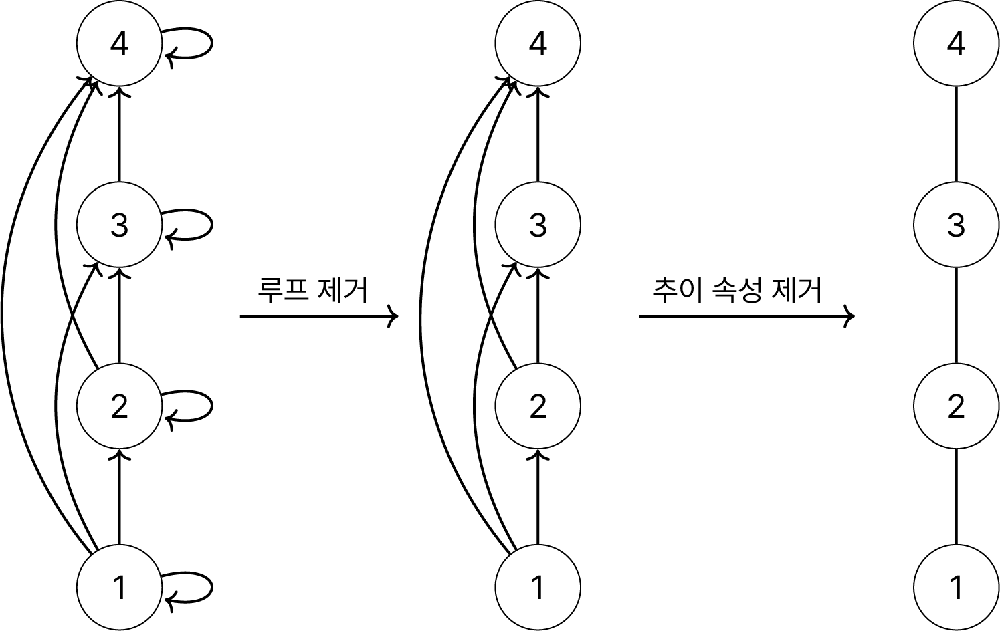

집합 $\{a, b, c\}$의 멱집합<sup>Power Set</sup> $A$에 대한 부분 집합 관계의 부분
순서 집합 $(A, \subseteq)$에 대한 하세 도표를 그려라

$$
A = \{\varnothing, \{a\}, \{b\}, \{c\}, \{a, b\}, \{a, c\}, \{b, c\}, \{a, b, c\} \}
$$

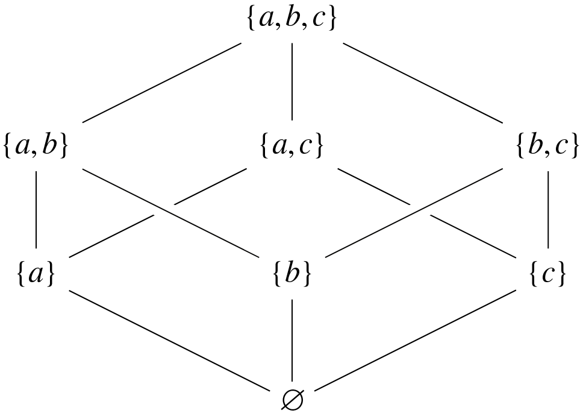

## 극대 원소와 극소 원소

부분 순서 집합 $(A, \lesssim)$가 있을 때

- 극대 원소<sup>Maximal Element</sup>: $A$의 원소 $a$에 대하여
  $a \lesssim b$인 원소 $b$가 $A$에 존재하지 않을 때 원소 $a$, 위의
  하세 도표에서 $\{a, b, c\}$에 해당

- 극소 원소<sup>Minimal Element</sup>: $b \lesssim a$인 원소 $b$가 $A$에
  존재하지 않을 때 원소 $a$, 위의 하세 도표에서 $\varnothing$에 해당

## 최대 원소와 최소 원소

- 최대 원소<sup>Greatest Element</sup>: 어떤 $a \in X$가 $X$의 모든 원소 $x$에
  대해 $x \lesssim a$이면, $a$를 $X$의 최대 원소
- 최소 원소<sup>Least Element</sup>: 어떤 $a \in X$가 $X$의 모든 원소 $x$에 대해
  $a \lesssim x$이면, $a$를 $X$의 최소 원소

## 함수<sup>Function</sup> $f: A \to B$

집합 $A, B$에 대해 집합 $A$에서 $B$로 가는 관계가 성립할 때, $a \in A$에
대해 $b \in B$ 하나가 대응되는 관계

$$
a \in A, b \in B, (a, b) \in f \text{일 때, } f(a) = b
$$

- 대응<sup>Correspondence</sup>: 집합 $A, B$가 있을 때, $a \in A$에 $b \in B$가
  확정되는 경우 '$b$는 $a$에 대응'

- $f: A \to B$에서

  - 정의역<sup>Domain</sup>: $\mathrm{dom}(f) = A$

  - 공변역<sup>Codomain</sup>: $\mathrm{codom}(f) = B$

  - 상<sup>Image</sup>: 함수값, $f(a) = b$

  - 치역<sup>Range</sup>: 상의 집합, $\mathrm{ran}(f) = \{f(a)|a \in A\}$

## 함수 vs 관계

- 관계

  - B의 원소와 대응하지 않는 A의 원소 존재 가능

  - 하나의 A의 원소가 하나 이상의 B의 원소와 대응 가능

- 함수

  - A의 모든 원소는 B의 원소와 무조건 대응

  - 하나의 A의 원소가 하나의 B의 원소와 대응

  - 하나의 B의 원소가 하나 이상의 A의 원소와 대응 가능

## 단사 함수<sup>Injective Function</sup>

- 정의역 $A$의 모든 원소들이 공변역 $B$의 서로 다른 원소와 대응

- 일대일 함수<sup>One-to-one Function</sup>

- $a_i, a_j \in A$에 대하여 $a_i \neq a_j$이면 $f(a_i) \neq f(a_j)$
  성립

- 단사 함수에서 함수의 치역은 공변역의 부분 집합

- $f:A \to B$에서 $\mathrm{ran}(f) \subseteq B$

- 단조 증가 함수<sup>Strictly Increasing Function</sup>:
  $x, y \in A, x < y \to f(x) < f(y)$

- 단조 감소 함수<sup>Strictly Decresaing Function</sup>:
  $x, y \in A, x < y \to f(x) > f(y)$

  - c.f.) 단조 증가 함수와 단조 감소 함수는 단사 함수

- 특성: $B$의 모든 원소가 $A$의 원소와 반드시 대응하는 것은 아니므로,
  $|A| \leq |B|$ 성립

## 전사 함수<sup>Surjective Function</sup>

- 공변역 $B$의 모든 원소가 정의역예 대응

- 치역 = 공변역, $\mathrm{ran}(f) = B$

- 모든 함수의 관계가 $B$의 모든 원소에 반영되므로 반영
  함수<sup>Onto Function</sup>

특성: $B$의 모든 원소가 $A$의 원소와 대응되어야 하므로 $|A| \geq |B|$
성립

## 전단사 함수<sup>Bijective Function</sup>

- 집합 $A$의 모든 원소들이 집합 $B$의 모든 원소와 하나씩 대응

- 일대일 대응 함수<sup>One-to-one Correspondence Function</sup>

특성: $A$의 모든 원소가 $B$의 모든 원소와 하나씩 일대일 대응되므로
$|A| = |B|$

## 합성 함수<sup>Composition Function</sup>

$\forall a \in A, (g \circ f)(a) = g(f(a))$\
결합 법칙 성립: $h\circ(g\circ f) = (h \circ g)\circ f$\
교환 법칙 성립 X

- 특징

  - $f:A \to B,\ g: B \to C$에 대해 $g \circ f$가 합성함수일 때

  - $f$와 $g$가 단사 함수면, $g\circ f$도 단사 함수다

  - $f$와 $g$가 전사 함수면, $g\circ f$도 전사 함수다

  - $f$와 $g$가 전단사 함수면, $g\circ f$도 전단사 함수다

  - $g\circ f$가 단사 함수면, $f$도 단사함수다

  - $g\circ f$가 전사 함수면, $g$도 단사함수다

  - $g\circ f$가 전단사 함수면, $f$는 단사함수고 $g$는 단사함수다

## 항등 함수<sup>Identity Function</sup>

$f(a) = a$\
전단사 함수라고도 함\
함수 $f: A \to B$고, 집합 $A$에 대한 항등 함수가 $I_A$, 집합 $B$에 대한
항등 함수가 $I_B$일 때, $f \circ I_A = I_B \circ f = f$

## 역함수<sup>Inverse Function</sup>

$\forall a \in A, \forall b \in B, f(a)=b \Rightarrow f^{-1}(b) = a$\
전단사 함수일 때만 역함수 존재

## 항등 함수와 역함수

전단사 함수 $f: A \to B,\ g: B \to C$에 대해, 다음이 성립

- $f^{-1} \circ f = I_A$

- $f \circ f^{-1} = I_B$

- $(g \circ f)^{-1} = f^{-1} \circ g^{-1}$

## 상수 함수<sup>Constant Function</sup>

$\forall a \in A, \exists b \in B, f(a) = b$

## 특성 함수<sup>Characteristic Function</sup>

$f_A(x) = \begin{cases}
        0,\quad x \not\in A \\
        1,\quad x \in A
    \end{cases}$

## 올림 함수<sup>Ceiling Function</sup>, 내림 함수<sup>Floor Function</sup>

올림 함수, 천정 함수 / 최소 정수 함수<sup>Least Integer Function</sup>:
$\left\lceil x \right\rceil = n \Leftrightarrow n - 1 < x \leq n$\
내림 함수, 바닥 함수 / 최대 정수 함수<sup>Greatest Integer Function</sup>:
$\left\lfloor x \right\rfloor = n \Leftrightarrow n \leq x < n + 1$

# Week 11

## 그래프<sup>Graph</sup>

공집합이 아닌 정점<sup>Vertex or Node</sup>의 집합 $V$와 서로 다른 정점의 쌍
$(v_i, v_j)$를 연결하는 변 또는 연결선<sup>Edge</sup>의 집합 $E$로 구성되는 구조
$G$

$G = (V, E)$
$V = \{v_1, v_2, \cdots, v_n\}$
$E = \{e_1, e_2, \cdots, e_m\} = \{(v_i, v_j), \cdots\}$\

e.g.)
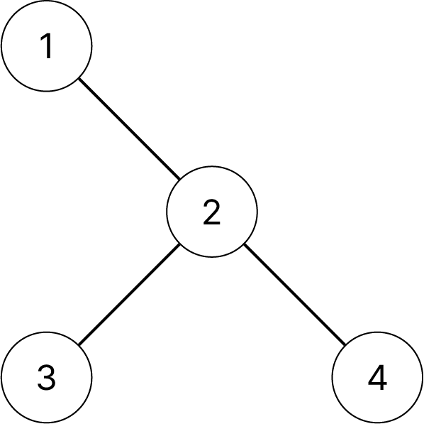

$$
V=\{1, 2, 3, 4\},\ E=\{(1, 2), (2, 3), (2, 4)\}
$$

무방향 그래프<sup>Undirected Graph</sup>: 특별한 언급 없으면 무방향 그래프\
방향 그래프<sup>Directed Graph, Digraph</sup>: 선행자 $\to$ 후속자\
단순 그래프<sup>Simple Graph</sup>: 루프가 없는 그래프\
멀티 그래프<sup>Multigraph</sup>:

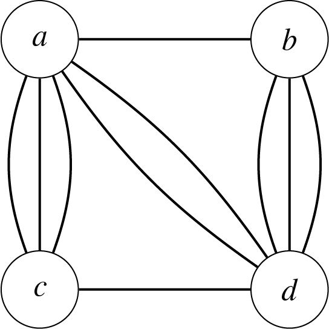

연결 그래프<sup>Connected Graph</sup>: 모든 Vertex가 연결된 그래프, 모든
Vertex간 경로 존재\
강한 연결 그래프<sup>Strongly Connected Graph</sup>: 방향 그래프에서만, 모든 두
Vertex $v_1, v_2$에 대해 $v_1 \leftrightarrow v_2$\
연결 요소<sup>Connectivity Component</sup>: 그래프에서 모든 Vertex들이 연결되어
있는 부분 그래프
연결 수<sup>Connectivity Number</sup>: $G$에서 연결 요소 개수

## 그래프 용어

인접<sup>Adjacent</sup>과 근접<sup>Incident</sup>:

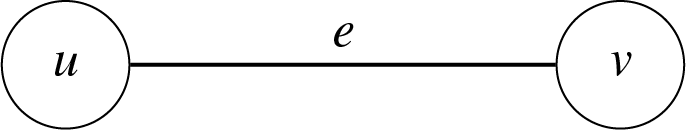
$u, v$는 서로 Adjacent, $e$는 $u, v$에 Incident

루프<sup>Loop</sup>:

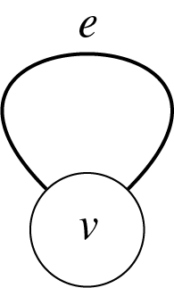
근접하는 점이 같은 $e$

- 경로<sup>Path</sup>: Vertex들의 열<sup>Sequence</sup> $v_1, v_2, \cdots, v_n$에서
  $(v_{k-1}, v_k) \in E, 1 \leq k < n$, 경로의 길이는 $k - 1$

  - 단순 경로<sup>Simple Path</sup>: 같은 Edge를 두 번 포함하지 않는 경로

  - 기본 경로<sup>Elementary Path</sup>: 같은 Node를 두 번 포함하지 않는 경로

- 사이클<sup>Cycle</sup> 또는 순회<sup>Circuit</sup>: $v_1=v_k(k \neq 1)$인 경로, 종점 ==
  시점

  - 단순 사이클<sup>Simple Cycle</sup>: 같은 Edge를 반복해 방문하지 않는 사이클

  - 기본 사이클<sup>Elementary Cycle</sup>: 시점 제외 어떤 Node도 반복해 방문하지
    않는 사이클

- 길이<sup>Length</sup>: 경로 또는 사이클을 구성하는 Edge의 수
- 차수<sup>Degree</sup> $d(v)$: Vertex $v$에 근접하는 Edge의 수, Loop는 두 개로
  Count

  - 홀수점<sup>Odd Vertex</sup>: 차수가 홀수인 Vertex

  - 짝수점<sup>Even Vertex</sup>: 차수가 짝수인 Vertex

- 외차수<sup>Out-degree</sup> $\mathrm{out-}d(v)$: 방향 그래프에서 Vertex $v$에서
  시작하는 화살표 수
- 내차수<sup>In-degree</sup> $\mathrm{in-}d(v)$: 방향 그래프에서 Vertex $v$에서
  끝나는 화살표 수

> \[정리\] 차수에 대한 정리
>
> - $G = (V, E)$에서, 모든 Vertex의 차수의 합은 Edge의 수의 두 배
>   $$
>   \sum_{v \in V} d(v) = 2|E|
>   $$
> - $G = (V, E)$에서, 차수가 홀수인 정점의 수는 짝수

## 오일러 경로<sup>Eulerian Path</sup> 및 오일러 회로<sup>Eulerian Circuit</sup>

- 오일러 경로: 멀티 그래프에서 모든 Edge들을 한 번씩만 통과하는 경로를
  찾는 문제
- 오일러 회로: Node는 여러 번 통과할 수 있지만, Edge는 한 번씩만 통과하는
  사이클
- 어떤 그래프 $G$가 오일러 경로를 가지기 위한 필요충분조건은 $G$가 연결
  그래프이고, 홀수 차수의 개수가 $0$ 또는 $2$인 경우이다.
- 어떤 그래프 $G$가 오일러 회로를 가지기 위한 필요충분조건은 $G$가 연결
  그래프이고, 모든 Node들이 짝수 개의 차수를 가지는 경우이다.

## 해밀턴 경로<sup>Hamiltonian Path</sup> 및 해밀턴 회로<sup>Hamiltonian Circuit</sup>

- 해밀턴 경로: 그래프에서 모든 Node를 오직 한 번씩만 지나지만 시점으로
  돌아오지 않는 경로
- 해밀턴 회로: 그래프에서 모든 Node를 오직 한 번씩만 지나는 순회
- 해밀턴 회로에 대한 충분 조건:

  - 차수 1을 갖는 Node를 가진 그래프는 해밀턴 순환을 가질 수 없다.

  - 차수가 2인 Node에 근접하는 두 Vertex는 해밀턴 순환에 포함된다.

  - 한 Node에 근접하는 두 Vertex가 해밀턴 순환에 포함되면, 그 Node에
    근접한 다른 Vertex는 해밀턴 순환에 포함될 수 없다.

\
Ore's Theorem: $n \geq 3$일 때, $n$개의 Node를 갖는 단순 연결 그래프
$G$에서 인접하지 않은 임의의 정점 $u, v$에 대해 $d(u) + d(v) \geq n$이면
$G$는 해밀턴 그래프이다.\
\
Dirac's Theorem: $n \geq 3$일 때, $n$개의 Node를 갖는 단순 연결 그래프
$G$에서 임의의 정점 $v$에 대해 $2d(v) \geq n$이면 $G$는 해밀턴
그래프이다.

## 특수 형태의 그래프

- 가중 그래프<sup>Weight Graph</sup>
  - $G$의 각 Edge에 $0$보다 큰 수가 할당되었을
    때, 이 값을 가중값<sup>Weight</sup>이라고 하며, 이를 가중 그래프라고 한다.

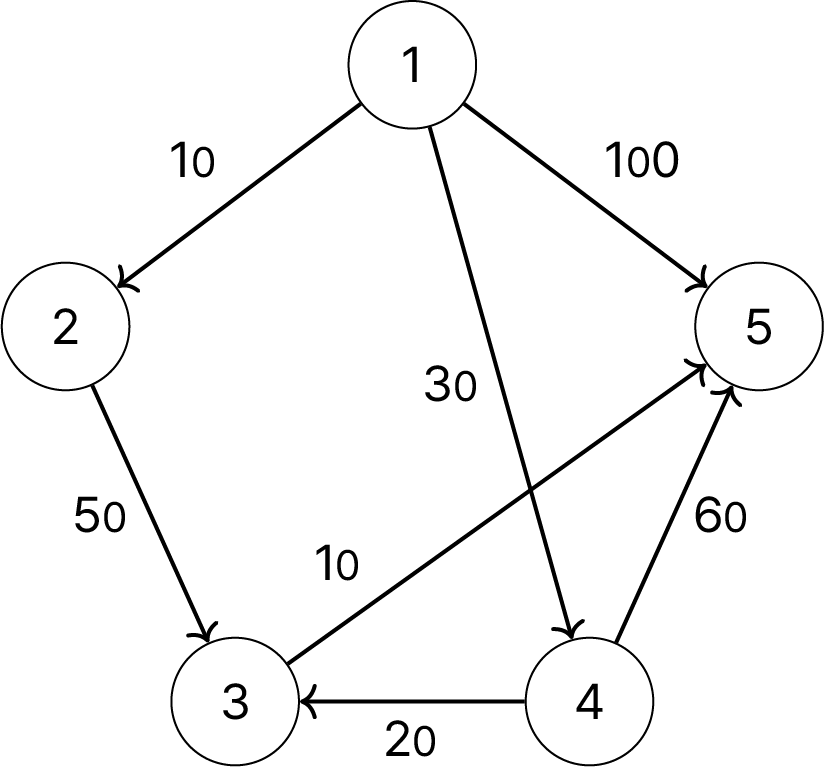

- 동형 그래프<sup>Isomorphic Graph</sup>
  - $G_1=(V_1, E_1)$과 $G_2=(V_2, E_2)$가
    주어졌을 때, 전단사 함수 $f:V_1\to V_2$가 존재하여
    $\{u, v\} \in E_1 \Leftrightarrow \{f(u), f(v)\} \in E_2$이면 $f$를
    동형<sup>Isomorphism</sup>이라고 하고, $G_1$과 $G_2$를 동형 그래프라 한다.

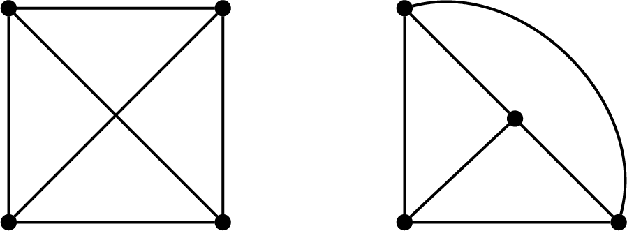

## 오일러의 정리

연결된 평면 그래프 $G$에서 Vertex의 수를 $v$, Edge의 수를 $e$,
면<sup>Space</sup>의 수를 $s$라고 할 때, $v - e + s = 2$

## 평면 그래프

평면 그래프<sup>Planar Graph</sup>: $G = (V, E)$를 평면에 그릴 때, 교차하지 않는
그래프\
면 $f$의 차수 $d(f)$: 평면 그래프의 면 $f$의 경계를 이루는 변의 수\
e.g.)

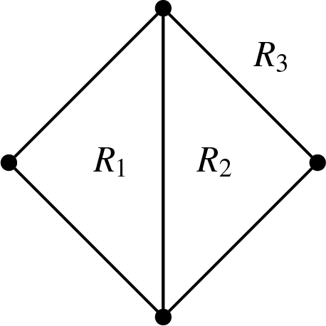

$$
d(R_1) = 3,\ d(R_2) = 3,\ d(R_3) = 4
$$

$$
d(R_1)+d(R_2)+d(R_3)=2e
$$

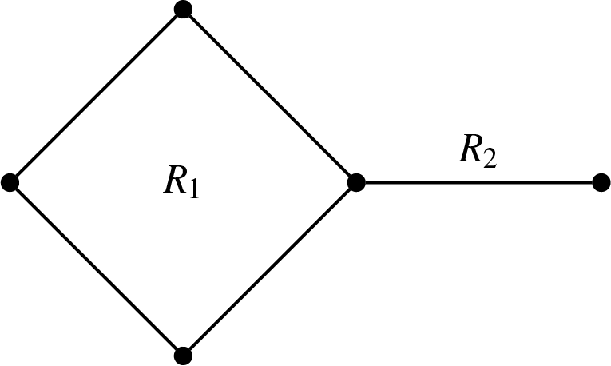

$$
d(R_1) = 4,\ d(R_2) = 6
$$

$$
d(R_1)+d(R_2)=2e
$$

평면 그래프의 면의 차수의 총 합은 변의 수의 두 배이다.

$$
2e = \sum_{f=1}^{n} d(f)
$$

연결된 평면 단순 그래프의 Vertex의 수를 $v$, Edge의 수를 $e$라 할 때,
$v \geq 3$이면 $e \leq 3(v-2)$\
모든 면의 차수는 3이상이므로,
$2e = \sum_{f=1}^{n} d(f) \geq 3f,\ 2 = v - e + f \leq c - e + \frac{2}{3}e \leq v - \frac{1}{3}e$

# Week 12

## 특수 형태의 그래프

- 완전 그래프<sup>Complete Graph</sup>
  - 모든 $n$개의 Vertex들의 쌍 사이에 Edge가
    존재하는 $G = K_n$

e.g.)
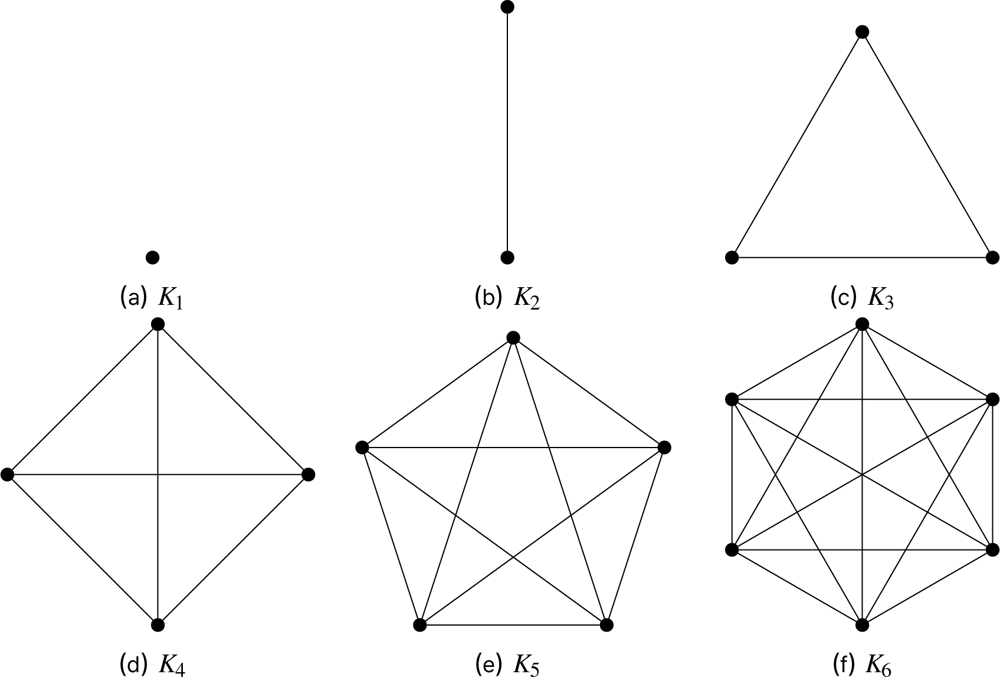

- 이분 그래프<sup>Bipartite Graph</sup>
  - $V$가 $X$와 $Y = V - X$로 나누어져, 각
    Edge가 X 내의 Vertex와 Y 내의 Vertex의 쌍으로 연결될 때, $G = (V, E)$
- 완전 이분 그래프<sup>Complete Bipartite Graph</sup>
  - $X$내의 모든 Vertex와
    $Y$내의 모든 Vertex 사이에 Edge가 존재할 때, 그래프 $G$

e.g.)
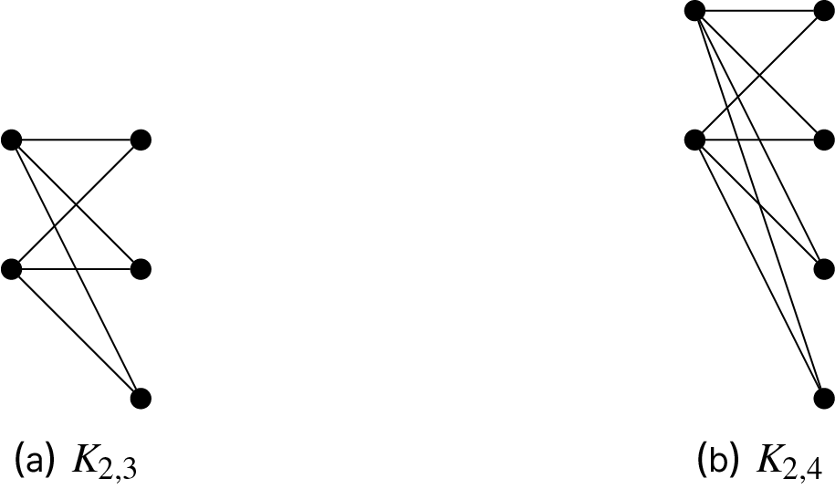

## 그래프의 표현 방법

- 인접 행렬<sup>Adjacency Matrix</sup>
  - $G = (V, E)$에서, $|V| = n$일 때, $G$의
    인접 행렬은 $n \times n$ 행렬 $A$

$$
a_{ij} = \begin{cases}
        1 \quad (v_i, v_j)\in E \\
        0 \quad \text{otherwise}
    \end{cases}
$$

- 인접 리스트<sup>Adjacency List</sup>

  - 각 Vertex에 대해 포인터가 주어지고, 그
    Vertex로 부터 인접한 Vertex들을 모두 Linked List에 담음 (List 내에서는
    순서에 관계가 없음)

- Linked List는 Node의 연결로 표현

  - Head: Linked List의 시작 Node (그래프의 각 Vertex들)

  - Node: 데이터 필드 + 포인트 필드 (다음에 연결된 Node의 주소 저장)

  - 마지막 Node의 포인트 필드는 `null`

## 그래프의 응용 및 활용

최단 경로 찾기<sup>Shortest Path Problem</sup>: 다익스트라<sup>Dijkstra</sup> 알고리즘

e.g.)

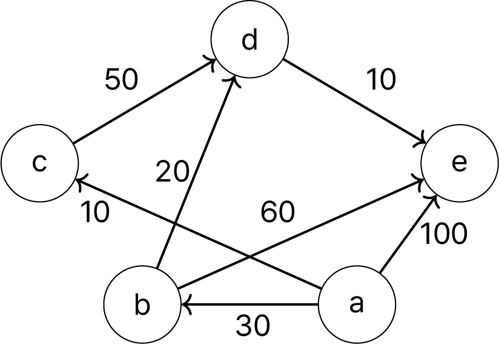

$$
\begin{bmatrix}
                  & a      & b      & c      & d      & e      \\
                a & 0      & 30     & 10     & \infty & 100    \\
                b & \infty & 0      & \infty & 20     & 60     \\
                c & \infty & \infty & 0      & 50     & \infty \\
                d & \infty & \infty & \infty & 0      & 10     \\
                e & \infty & \infty & \infty & \infty & 0      \\
            \end{bmatrix}
$$

\
\
위와 같은 그래프가 주어졌을 때,

|       $S$        |     | `D[a]` | `D[b]` | `D[c]` |  `D[d]`  | `D[e]` |
| :--------------: | :-: | :----: | :----: | :----: | :------: | :----: |
|     $\{a\}$      | $a$ |  $0$   |  $30$  |  $10$  | $\infty$ | $100$  |
|    $\{a, c\}$    | $c$ |        |  $30$  |  $10$  |   $60$   | $100$  |
|  $\{a, c, b\}$   | $b$ |        |  $30$  |        |   $50$   |  $90$  |
| $\{a, c, b, d\}$ | $d$ |        |        |        |   $50$   |  $60$  |

해밀턴 순회의 응용: 일반적인 해결 알고리즘 존재 X $\to$ 최근접 이웃
방법<sup>Nearest Neighbour Method</sup>(Greedy 알고리즘)

## 그래프의 탐색(Traversal)

- 깊이 우선 탐색<sup>Depth First Search; DFS</sup>

  - Stack or 재귀로 구현

  - 시작 Vertex $v$에서 인접 Vertex 중 방문하지 않은 Vertex $w$ 방문

  - $w$에서 다시 인접 Vertex 중 방문하지 않은 Vertex $u$ 방문 반복

  - 어떤 Vertex $\nu$ 방문 후 $\nu$에 인접한 모든 Vertex 방문한 경우,
    바로 이전 Vertex로 돌아가 위 반복

  - 모든 Vertex 방문 후 탐색 종료

- 너비 우선 탐색<sup>Breadth First Search; BFS</sup>

  - Queue 사용

  - 시작 Vertex $v$에서 인접한 Vertex 모두 차례로 방문

  - 더 이상 방문할 Vertex가 없을 때, 다시 $v$에 인접한 Vertex중 처음
    방문한 Vertex와 인접한 Vertex 방문

  - $v$에 인접한 Vertex중 두 번째 방문한 Vertex와 인접한 Vertex 방문
    반복

  - 모든 Vertex 방문 후 탐색 종료

## 트리<sup>Tree</sup>

- A connected undirected graph with no circuits

- An undirected graph is a tree iff there is a unique simple path
  between any two of its vertices

- 특별히 지정된 노드인 루트가 있고, 나머지 노드들은 다시 각각
  트리이면서 연결되지 않는(disjoint)
  $T_1, T_2, \cdots, T_n(n \geq 0, T_n$은 루트의 서브 트리(Subtree)$)$으로
  나누어 진다.

\
루트<sup>Root</sup>: 주어진 트리의 시작 노드, 트리의 가장 높은 곳에 위치\
차수<sup>Degree</sup>: 각 노드의 서브 트리의 개수\
잎 노드 or 단말 노드<sup>Leaf Node</sup>: 차수가 0인 노드\
자식 노드<sup>Children Node</sup>: 어떤 노드의 서브 트리의 루트 노드\
부모 노드<sup>Parent Node</sup>: 자식 노드의 반대\
형제 노드<sup>Sibling Node</sup>: 동일한 부모를 가지는 노드\
중간 노드<sup>Internal Node</sup>: 자식 노드를 갖는 노드\
조상<sup>Ancestor</sup>: 루트로부터 각 노드에 이르는 경로 상에 나타난 모든
노드들\
자손<sup>Descendant</sup>: 각 노드부터 잎 노드에 이르는 경로 상에 나타난 모든
노드들\
레벨<sup>Level</sup>: 루트의 레벨 $= 0$, 자손 노드로 내려가며 `++`\
트리의 높이 or 깊이<sup>Height or Depth</sup>: 트리에서 노드가 가질 수 있는
맥스 레벨\
숲<sup>Forest</sup>: 서로 연결되지 않는 트리들의 집합, 트리에서 루트를 제거 $\to$
숲 생성\
\
$G$는 트리\
$\equiv$ $G$는 연결되어 있고, $M = n - 1$\
$\equiv$ $G$는 연결되어 있고, 어느 한 연결선만을 제거하더라도 $G$는
연결되지 않음\
$\equiv$ $G$는 사이클을 가지지 않고, $m = n - 1$\
$\equiv$ $G$는 어느 한 연결선만 첨가하더라도 사이클 형성

## 이진 트리

이진 트리<sup>Binary Tree</sup>: 노드들의 유한 집합, 공집합이거나, 루트와 왼쪽
서브 트리, 오른쪽 서브 트리로 이루어짐\
사향 이진 트리<sup>Skewed Binary Tree</sup>: 왼쪽 or 오른쪽으로 편향된 트리\
완전 이진 트리<sup>Complete Binary Tree</sup>: 높이가 $k$일 때 레벨 $1$부터
$k-1$까지는 모두 차있고 레벨 $k$에서는 왼쪽 노드부터 차례로 차있는 이진
트리\
포화 이진 트리<sup>Full Binary Tree</sup>: 잎 노드가 아닌 것들은 모두 $2$개씩
자식 노드를 가지며 트리의 높이가 일정할 때\
\
완전 $n$-ary 트리: 레벨이 $k$일 때, 레벨 $1$부터 $k-1$까지는 모두 n개의
자식 노드를 가지고, 레벨 $k$에서는 왼쪽 노드부터 차례로 차있는 트리\
포화 $n$-ary 트리: 모든 중간 노드가 $n$개의 자식 노드를 가지는 트리

포화 $n$-ary 트리에서 $m$개의 중간 노드를 가질 때, 전체 노드 개수
$= (m + 1) * n + 1$(루트 노드)\
\
이진 트리가 레벨 $i$에서 가질 수 있는 최대 노드 수 $= 2^i$\
높이가 $k$인 이진 트리가 가질 수 있는 최대 전체 노드 수
$= 2^{k + 1} - 1$\
잎 노드 개수 $= n_0$, 차수가 $2$인 노드 개수 $= n_2$일 때,
$n_0 = n_2 + 1$ 항상 성립

## 이진 트리의 표현

- 배열

  - 트리의 중간에 새로운 노드를 삽입하거나 기존의 노드를 지울 때
    비효율적

  - 높이가 $h$인 이진 트리는 각 노드 번호를 인덱스로 하여 1차원 배열로
    구현 가능 (인덱스는 1부터 시작)

  - 노드 인덱스 $n$의 부모 인덱스
    $= \left\lfloor \dfrac{n}{2} \right\rfloor$

  - 노드 인덱스 $n$의 왼쪽 자식 인덱스 $= 2n$, 오른쪽 자식 인덱스
    $= 2n + 1$

- 연결 리스트: 일반적으로 가장 많이 사용. 중간 데이터, 왼쪽 자식 포인터,
  오른쪽 자식 포인터 저장

# Week 13

## 이진 트리의 탐방

- 트리의 각 노드를 꼭 한 번씩만 방문<sup>Traversal</sup>하는 방법

  - 각 노드와 그 노드의 서브 트리를 같은 방법으로 탐방

  - 전순위, 중순위, 후순위 탐방 기법

  - D: 노드, L: 노드의 왼쪽 서브 트리, R:노드의 오른쪽 서브 트리, 왼쪽을 오른쪽보다 항상 먼저 방문한다고 가정

    - 중순위: LDR

    - 전순위: DLR

    - 후순위: LRD

  - 수식 표현에서 중순위 표기<sup>Infix</sup>, 전순위 표기<sup>Prefix</sup>, 후순위
    표기<sup>Postfix</sup>와 각각 대응

\
탐방의 결과, 각 노드에 들어있는 데이터를 차례로 나열\
\
중순위:

```cpp
void inOrder(TREE* currentNode) {
    if (currentNode != NULL) {
        inOrder(currentNode->leftChild);
        std::cout << currentNode->data;
        inOrder(currentNode->rightChild);
    }
}
```

전순위:

```cpp
void preOrder(TREE* currentNode) {
    if (currentNode != NULL) {
        std::cout << currentNode->data;
        preOrder(currentNode->leftChild);
        preOrder(currentNode->rightChild);
    }
}
```

후순위:

```cpp
void postOrder(TREE* currentNode) {
    if (currentNode != NULL) {
        postOrder(currentNode->leftChild);
        postOrder(currentNode->rightChild);
        std::cout << currentNode->data;
    }
}
```

## 순회 표기 & 수식 트리

중순위: $(a+b)\times(c-d)$\
전순위: $\times + ab-cd$\
후순위: $ab+cd-\times$\
\
전순위 수식 $+-\times\ 2\ 3\ 5 \div \wedge\  2\ 3\ 4$ `==` 중순위 수식
$2 \times 3 - 5 + 2^3 \div 4$\
후순위 수식 $7\ 2\ 3\times - 4 \wedge 9\ 3 \div +$ `==` 중순위 수식
$(7 - 2 \times 3)^4 + 9 \div 3$

- 후순위 표기식과 스택을 활용하여 수식 트리 생성

  - 후순위 표기식이 주어지면 스택에 피연산자 저장

  - 연산자를 만나면 스택에서 두 개의 피연산자 `pop()` 후 연산 결과(트리)
    다시 저장

## 생성 트리와 최소 비용 생성 트리

생성 트리<sup>Spanning Tree</sup>: $\exists G$에서 모든 노드들을 포함하는 트리\
비용<sup>Cost </sup>: 트리 연결선의 값의 합\
최소 비용 생성 트리(Minimum Spanning Tree: MST): 생성 트리 중 최소 비용

- Prim's Algorithm

  - $G = (V, E)$에서 $V = \{1, 2, \cdots, n\}$

  - 노드의 집합 $U$를 $1$로 시작

  - $u \in U,\ v \in V - U$일 때, $U$와 $V-U$를 연결하는 사이클 형성 X인
    가장 짧은 연결선 $(u, v)$를 찾아 $v$를 $U$에 포함시킴

  - 위를 $U-V$까지 반복

```cpp
void prim(graph G: set_of_edges T) {
    set_of_vertices U;
    vertex u, v;
    T = NULL;
    U = {1};
    while (U != V) {
        let (u, v) be a lowest cost edge such that u is in U and v is in V - U;
        if ((u, v) does not create a cycle) {
            T = T |$\cup$| {(u, v)};
            U = U |$\cup$| {v};
        }
    }
}
```

- Kruskal Algorithm:

  - $G = (V, E)$에서 $V = \{1, 2, \cdots, n\}$, $T =$ (연결선의 집합)

  - Let $T = \varnothing$

  - $E$를 비용이 적은 순서로 정렬

  - 가장 최솟값 가진 연결선 $(u, v)$ 차례로 찾아 사이클 형성 X이면 $T$에
    포함

  - 위를 $|T| = |V| - 1$까지 반복

```cpp
void kruskal(graph G: set_of_edges T) {
    T = NULL;
    while (T contains less than n - 1 edges and E is not empty) {
        choose an edge (v, w) from E of lowest cost;
        delete (v, w) from E;
        if ((v, w) does not create a cycle in T)
            add (v, w) to T;
        else discard (v, w);
    }
    if (T contains fewer than n - 1 edges)
        std::cout << "No Spanning Tree";
}
```

## 트리의 활용

- 문법의 파싱<sup>Parsing </sup>
- 허프만 코드<sup>Huffman Code</sup>

  - 알파벳 문자를 $0$과 $1$의 비트 코드로 Encoding

  - 문자의 발생 빈도에 따라 코드의 길이를 다르게 $\to$ 통신의 효율성

  - 접두어 성질: 어떤 문자 코드도 다른 문자 코드의 접두어 코드가 아님

- Huffman Algorithm

  - 발생 빈도가 가장 낮은 두 문자를 선택해 하나의 이진 트리로 연결

    - 왼쪽 노드에는 빈도수 낮은 문자, 오른쪽 노드에는 빈도수 높은 문자

    - 그 두 문자의 루트 노드는 두 문자의 빈도의 합

    - 문자들을 이진 트리로 연결

    - 그 후에 이진 트리들을 연결

  - 위 과정을 모든 문자가 하나의 이진 트리로 묶일 때까지 반복

  - 생성된 이진 트리의 왼쪽 노드는 $0$, 오른쪽 노드에는 $1$ 부여

  - 루트부터 해당 문자까지 $0$ 또는 $1$을 순서대로 나열한 것이 해당
    문자의 허프만 코드

# Week 14

## 이진 탐색 트리<sup>Binary Search Tree</sup>

- 모든 노드 $x$에 대하여 노드 $y$가 노드 $x$의 왼쪽 서브 트리에 있을
  때 $y < x$이고, 노드 $z$가 노드 $x$의 오른쪽 서브 트리에 있으면
  $x < z$인 이진 트리

- $<$는 순서 관계를 의미

- 높이 균형 이진 트리인 경우 탐색 시간은 $\log n$

## 결정 트리<sup>Decision Tree</sup>

8개의 동전 문제

## 부울식

0과 1의 조합으로 연산\
$A = \{0, 1\}$에 대해 이항 연산자<sup>Binary Operator</sup> $+$<sup>OR</sup>과
$\cdot$<sup>AND</sup> 및 단항 연산자<sup>Unary Operator</sup> $'$<sup>Complement</sup>로 표현되는
식\
연산 우선 순위: $' > \cdot > +$\
\
두 부울식이 같은 진리표<sup>Truth Table</sup>을 가질 때 동치<sup>Equivalent</sup>,
연산자는 $=$

|                    이름                    |                                          법칙                                           |
| :----------------------------------------: | :-------------------------------------------------------------------------------------: |
|     멱등 법칙<sup>Idempotent Law</sup>     |                             $p \cdot p = p$<br/>$p + p = p$                             |
|      항등 법칙<sup>Identity Law</sup>      |                             $p + 0 = p$<br/>$p \cdot 1 = p$                             |
|    교환 법칙<sup>Commutative Law</sup>     |                       $p + q = q + p$<br/>$p \cdot q = q \cdot p$                       |
|    결합 법칙<sup>Associative Law</sup>     |        $p + (q + r) = (p + q) + r$<br/>$p\cdot(q \cdot r) = (p \cdot q) \cdot r$        |
|    분배 법칙<sup>Distributive Law</sup>    | $p + (q \cdot r) = (p + q)\cdot(p + r)$<br/>$p \cdot (q + r) = (p \cdot q)+(p \cdot r)$ |
|     흡수 법칙<sup>Absorption Law</sup>     |                      $p+(p\cdot q) = p$<br/>$p \cdot (p + q) = p$                       |
|       역 법칙<sup>Inverse Law</sup>        |                              $p + p'$<br/>$p\cdot p' = 0$                               |
|      보 법칙<sup>Complement Law</sup>      |                                       $(p')' = p$                                       |
|     우등 법칙<sup>Dominance Law</sup>      |                             $p + 1 = 1$<br/>$p \cdot 0 = 0$                             |
| 드 모르간의 법칙<sup>De Morgan's law</sup> |                  $(p + q)' = p' \cdot q'$<br/>$(p \cdot q)' = p' + q'$                  |

## 부울 함수<sup>Boolean Function</sup>

부울 변수와 부울 연산자로 구성된 부울식\
$n$개의 부울 변수 $x_1, x_2, \cdots, x_n$에 대한 부울 함수는
$f(x_1, x_2, \cdots, x_n)$으로 표현\
$n$개의 부울 변수가 있을 때, 그 변수들로부터 얻을 수 있는 조합은
$2^n$개\
\
리터럴<sup>Literal</sup>: 부울 함수를 구성하는 부울 변수 또는 그의 보수\
최소항<sup>Minterm</sup>: $n$차 부울함수 $f(x_1, x_2, \cdots, x_n)$을 구성하는
논리곱 항들 중 $n$개의 리터럴 곱으로 구성된 항

## 최소항

부울 함수는 부울 변수에 대한 최소항들 중에서 $1$의 값을 가지는
최소항들의 부울 합을 식으로 표현하는 함수

e.g.)

| $x$ | $y$ | $z$ | $f(x, y, z)$ |
| :-: | :-: | :-: | :----------: |
|  0  |  0  |  0  |      0       |
|  0  |  0  |  1  |      1       |
|  0  |  1  |  0  |      0       |
|  0  |  1  |  1  |      0       |
|  1  |  0  |  0  |      1       |
|  1  |  0  |  1  |      0       |
|  1  |  1  |  0  |      1       |
|  1  |  1  |  1  |      0       |

부울 함수는 $f(x, y, z)=1$인 최소항들의 합이므로
$f(x, y, z) = x' y' z + xy' z' + xyz'$이다.

## 정규식<sup>Disjunctive Normal Form; DNF</sup>

최소항들의 부울합으로 표현된 부울 함수\
최소항들은 부울 변수의 곱으로 표현\
곱의 합(Sum of Products) 또는 논리합 표준형

- 정규식이 아닌 부울 함수를 정규식으로 표현하는 방법

  - 진리표를 이용한 정규식 변환

  - 부울 법칙을 이용한 정규식 변환

    - 각 항에 포함되지 않은 부울 변수를 파악

    - 각 항에 포함되지 않은 부울 변수에 대해

    - 논리곱에 대한 항등 법칙 $x \cdot 1 = x$와

    - 논리합에 대한 보수 법칙 $x + x' = 1$을 적용

    - 각 항에 없는 부울 변수 추가

    - 분배 법칙 등을 이용해 식을 풀고, 중복되는 항은 멱등 법칙에 의해
      제거

  e.g.)

  $$
  \begin{aligned}
  f(x, y) &= x + y'\\
  &= x\cdot 1 + y' \cdot 1  &(\because \text{항등 법칙})\\
  &= x(y + y') + y' (x + x')  &(\because \text{보수 법칙})\\
  &= xy + xy' + y'x + y'x'  &(\because \text{분배 법칙})\\
  &= xy + xy' + xy' + x'y'  &(\because \text{교환 법칙})\\
  &= xy + xy' + x'y'  &(\because \text{멱등 법칙})
  \end{aligned}
  $$

  $$
  \therefore f(x, y) = xy + xy' + x'y'
  $$

## 예제 풀이

1\. $(x+y)(y+z)(z+x)= xy + yz + zx$

$$
\begin{aligned}
    (x+y)(y+z)(z+x) & = (xy + xz + yy + yz)(z + x)\\
                    & = (xy + xz + y + yz)(z + x)\\
                    & = (xy + xz + y (1 + z))(z + x)\\
                    & = (xy + xz + y)(z + x)\\
                    & = xyz + xxy + xzz + xxz + yz + xy\\
                    & = xyz + xy + yz + zx\\
                    & = xy(z + 1) + yz + zx\\
                    & = xy + yz + zx\\
\end{aligned}
$$

\
2. $xy + yz + x' z = xy + x' z$

$$
\begin{aligned}
    xy + yz + x' z & = xy + 1\cdot yz + x' z   \\
                   & = xy + (x+x')yz + x' z    \\
                   & = xy + xyz + x' yz + x' z \\
                   & = xy(1 + z) + x' z(y + 1) \\
                   & = xy + x' z
\end{aligned}
$$

# Week 15

## 부울 함수의 간소화

더 적은 변수와 연산자를 사용하여 같은 기능 또는 결과 도출

- 부울 함수를 간소화 하는 방법:

  - 부울식의 기본 법칙 사용 $\to$ 과정이 복잡하고 간소화에 대한 확인이
    쉽지 않음

  - 카르노맵을 사용

- 카르노맵<sup>Karnaugh Map</sup>

  - 부울 함수가 가질 수 있는 모든 경우의 최소항들을 사각형 형태의 표에
    배열한 후, $1$의 값을 가지는 최소항들만 $1$로 표시

    - $1$을 갖는 항들을 연결하여 최소화

  - 사각형 내 배치 시, 인접한 최소항들은 변수 하나 차이만 있도록 배치

    - $xy$와 $xy'$은 인접 가능

    - $xy$와 $x'y'$은 인접 불가

- 두 변수에 대한 카르노맵: 변수를 $x, y$라 할 때, 모든 가능한 최소항 조합

  - $x'y', x'y, xy', xy$

  - $x$가 $0$이고, $y$가 $0$일 때, 부울식은 $x'y'$

\(a\) 두 변수에 대한 카르노 맵
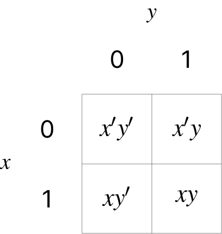

\(b\) $f(x, y) = x'y' + x'y + xy'$

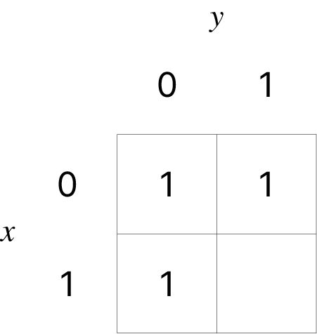

- 간소화: $1$로 표시된 사각형이 인접할 경우, 함께 묶을 수 있는 경우

e.g.) \(a\) 인접한 경우 없음: $x'y' + xy$
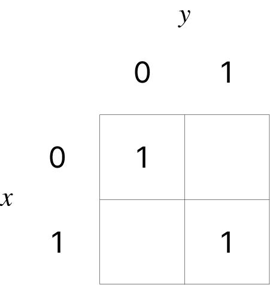
\(b\) $y$의 값에 관계없이 $x$의 값이 $0$: $x'$ ($x'$일 때 1)
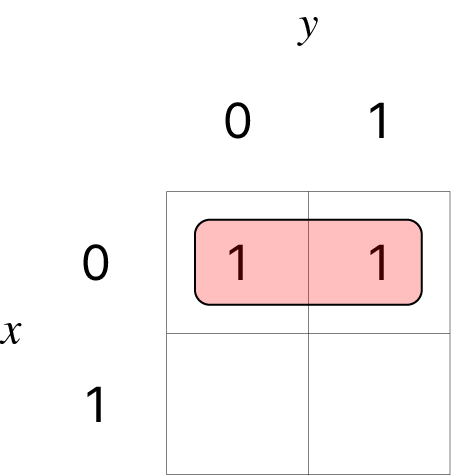
\(c\) (b)의 경우 + $x$의 값에 관계 없이 $y' = x' + y'$
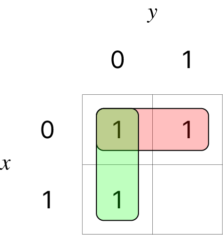
\(d\) $x$와 $y$의 값에 관계없이 항상 1: 1
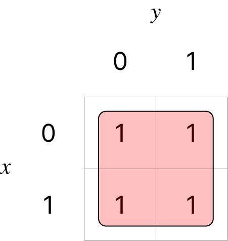

- 세 변수에 대한 카르노 맵:

  - $yz$에 대한 사각형에서 $00, 01$ 다음에 $11$ (인접하는 행 또는 열에서
    1비트 차이만 나야함)

  - 왼쪽 끝은 오른쪽 끝과 인접하다 생각하기

\(a\) 세 변수에 대한 카르노 맵
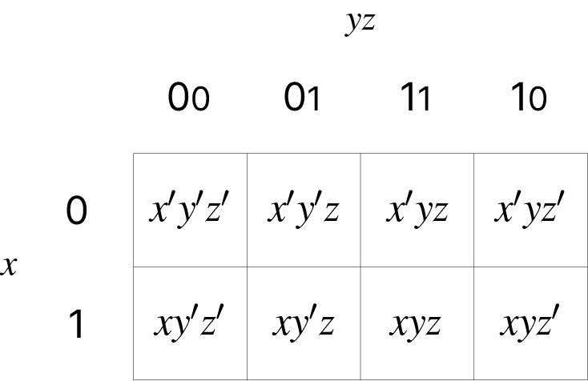

\(b\) $f(x, y, z) = x'y'z' + z'yz + xy'z' + xyz = z'$

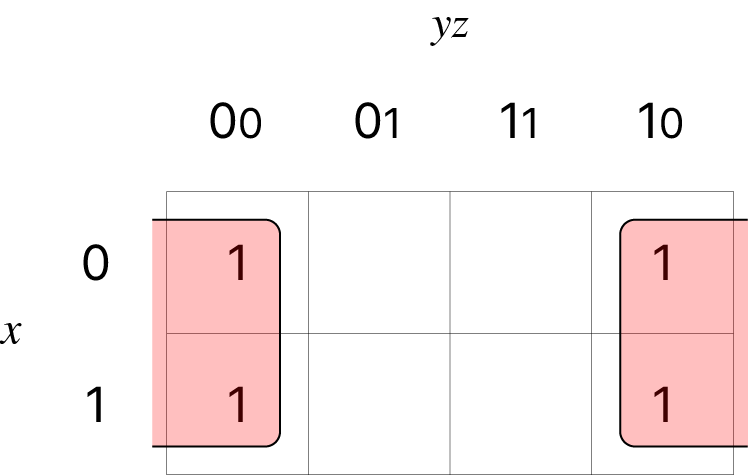

- 네 변수에 대한 카르노 맵

  - $01$ 다음 $11$

  - 왼쪽 끝과 오른쪽 끝 인접

  - 위쪽 끝과 아래쪽 끝 인접

\(a\) 네 변수에 대한 카르노 맵
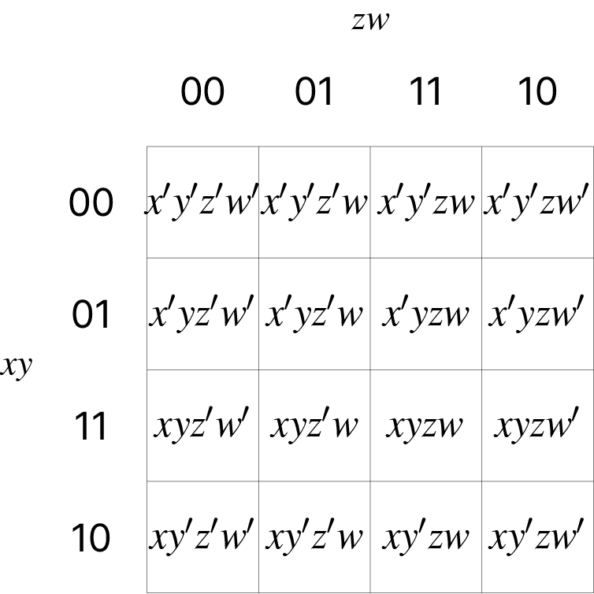

\(b\) $f(x, y, z, w) = x'y'z'w' + z'y'zw' + x'yz'w + x'yzw + xyz'w + xy'z'w' + xy'zw' = yw + y'w'$

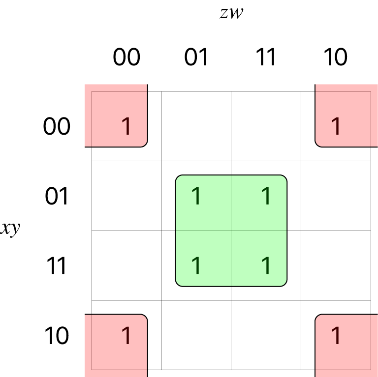

## 논리 회로<sup>Logic Circuit</sup>

- 논리 회로의 입출력은 논리 게이트<sup>Gate</sup>들을 상호 연결해 구성

- 입력은 부울 변수, 출력은 부울 함수, 부울 연산자는 게이트

- $1$ = On, $0$ = Off

\
회로를 설계하기 전에 먼저 부울식을 간소화하는 과정이 필요\
논리 함수의 완전성<sup>Completeness</sup>: 부울 연산자 AND, OR, NOT만으로도 모든
논리 함수들을 나타낼 수 있다.

| 게이트 |        기호         |             수식              |
| :----: | :-----------------: | :---------------------------: |
|  AND   |  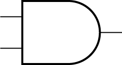  |         $x=A \cdot B$         |
|   OR   |   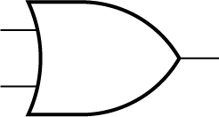   |           $x=A + B$           |
|  NOT   |  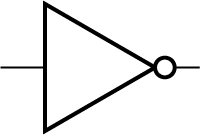  |            $x=A'$             |
|  NAND  | 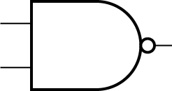 |       $x=(A \cdot B)'$        |
|  NOR   |  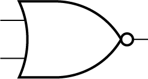  |         $x=(A + B)'$          |
|  XOR   |  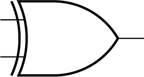  |  $x=A \oplus B = A'B + AB'$   |
|  XNOR  | 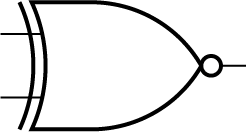 | $x=(A \oplus B)' = AB + A'B'$ |

NAND와 NOR의 다른 표현: 드 모르간의 법칙을 적용
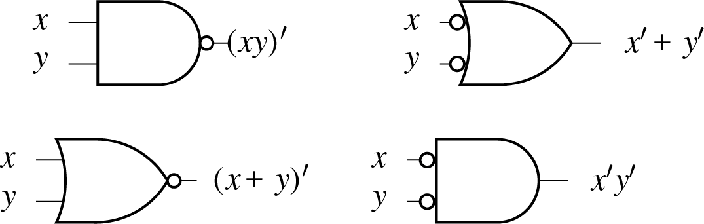

## 가산기<sup>Adder</sup>

두 개 이상의 입력을 받아서 이들의 합을 출력

### 반가산기<sup>Half Adder</sup>

- 입력: 1비트 정보 두 개

- 출력: 1비트 정보 두 개, 합<sup>Sum</sup> + 자리 올림<sup>Carry</sup>

\(a\) 반가산기의 계산
| $A$ | $B$ | 올림수($C$) | 합($S$) |
| :-: | :-: | :-------: | :-----: |
|0|0|0|0|
|0|1|0|1|
|1|0|0|1|
|1|1|1|0|

\(b\) 반가산기 논리 회로
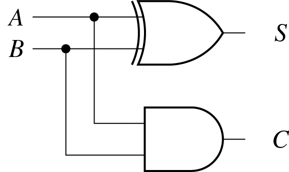

### 전가산기<sup>Full Adder</sup>

입력 두 개와 하위 비트에서 발생한 자리 올림수 포함. 2진수 3개 덧셈

전가산기의 계산
| $A$ | $B$ | $C_0$ | 올림수($C$) | 합($S$) |
| :-: | :-: | :-: | :----------: | :---: |
| 0 | 0 | 0 | 0 | 0 |
| 0 | 0 | 1 | 0 | 1 |
| 0 | 1 | 0 | 0 | 1 |
| 0 | 1 | 1 | 1 | 0 |
| 1 | 0 | 0 | 0 | 1 |
| 1 | 0 | 1 | 1 | 0 |
| 1 | 1 | 0 | 1 | 0 |
| 1 | 1 | 1 | 1 | 1 |

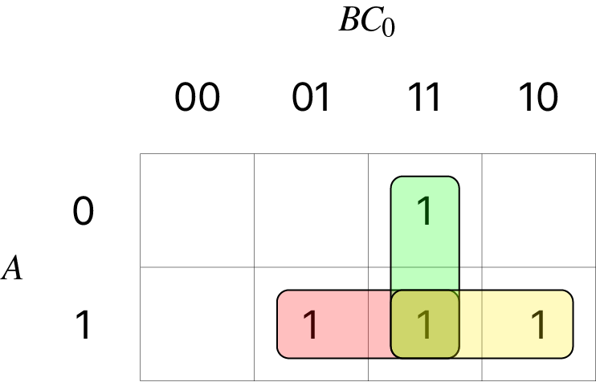
\(a\) Carry

$$
\begin{aligned}
\text{Carry} &= AC_0 + AB + BC_0\\
&= AB + (A'B + AB)C_0\\
&= AB + (A \oplus B)C_0
\end{aligned}
$$

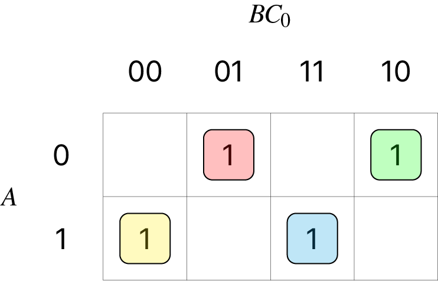
\(b\) Sum

$$
\begin{aligned}
\text{Sum} &= AB'C'_0 + A'B'C_0 + ABC_0 + A'BC'_0\\
&= A \oplus B \oplus C_0
\end{aligned}
$$

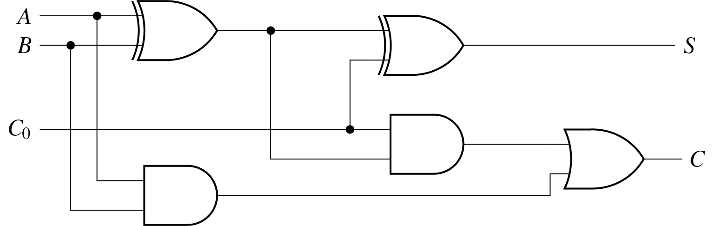
\(c\) 전가산기 논리회로

### 병렬 가산기

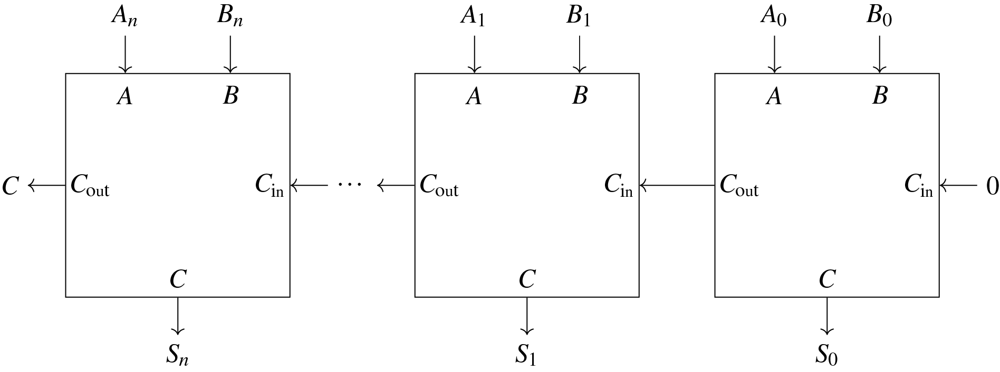
